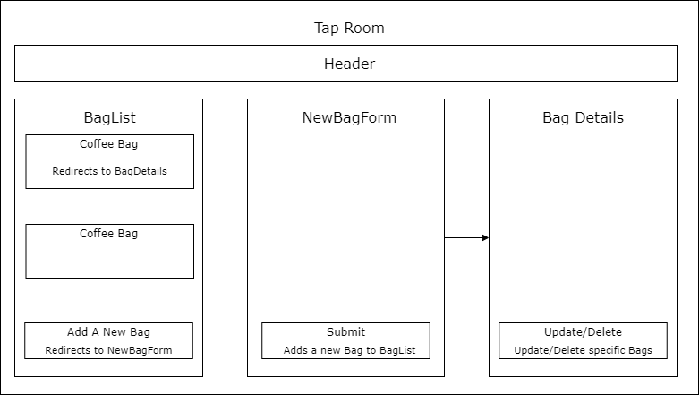

# _Tap Room_

#### _Epicodus Project Jul 3, 2020_

#### By _**Jason Macie**_

## Description

_This is a react application that implements CRUD functionality. Users should be able to Create, Read, Update, and Delete bags of coffee._

## Setup/Installation Requirements

1. Clone this repository.
2. Open terminal into the root directory of this project and run: `npm start`
3. A new tab should open in your browser.

## Known Bugs

There are no known bugs at the time of this update.

## Technologies Used

* React
* Javascript
* Node Package Manager

## Specs

### License

This software is licensed under the MIT license.

Copyright (c) 2020 **_Jason Macie_**